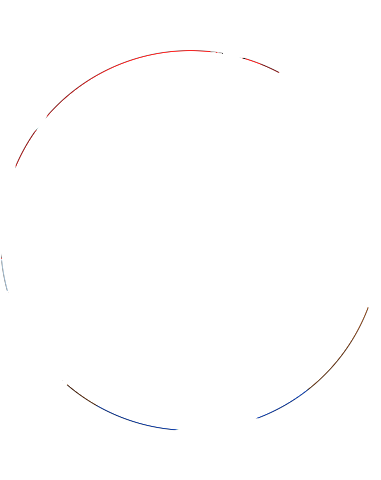
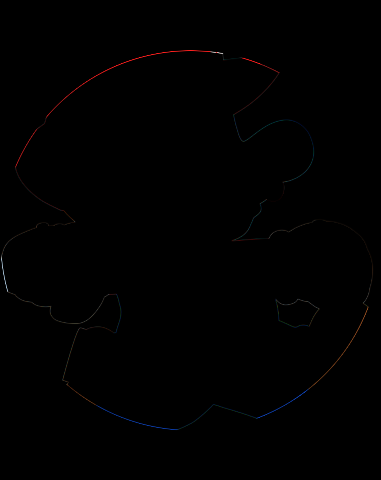

# diffimg-go

Image differentiation tool similar to my python module and command line tool
`diffimg`: https://github.com/nicolashahn/diffimg

You may find it useful for testing image processing applications/services.

## Installation

```
go get github.com/nicolashahn/diffimg-go
```

## Usage

```
$ diffimg-go [-generate] [-ratio] [-ignorealpha] IMAGE1 IMAGE2
```

`IMAGE1` and `IMAGE2` are image files. They must be the same size.

`-generate` creates a diff image at `diff.png`.

`-ratio` returns a `float` ratio instead of the sentence `Images differ by
X.XX%`

`-ignorealpha` ignores the alpha channel for the ratio calculation, and if
generating a diff image, sets the alpha value for all pixels to max. If both
images are fully opaque (all the alpha channel values for all pixels in both
images are the maximum value) then a simple diff (without ignorealpha) would 
produce a fully transparent image. Use this flag if you do not want that.
It gives a different diff ratio because the calculation is now being done
with 3 instead of 4 channels.

## Examples
The images used in these examples are [here](test/data/mario-circle-cs.png)
and [here](test/data/mario-circle-node.png).

```
$ diffimg-go test/data/mario-circle-cs.png test/data/mario-circle-node.png
Images differ by 0.21239256857598682%

$ diffimg-go -ratio test/data/mario-circle-cs.png test/data/mario-circle-node.png
0.002123925685759868

$ diffimg-go -ignorealpha test/data/mario-circle-cs.png test/data/mario-circle-node.png
Images differ by 0.1747815632523059%

$ diffimg-go -generate test/data/mario-circle-cs.png test/data/mario-circle-node.png
$ open diff.png
```


```
$ diffimg-go -generate test/data/mario-circle-cs.png test/data/mario-circle-node.png
$ open diff.png
```


